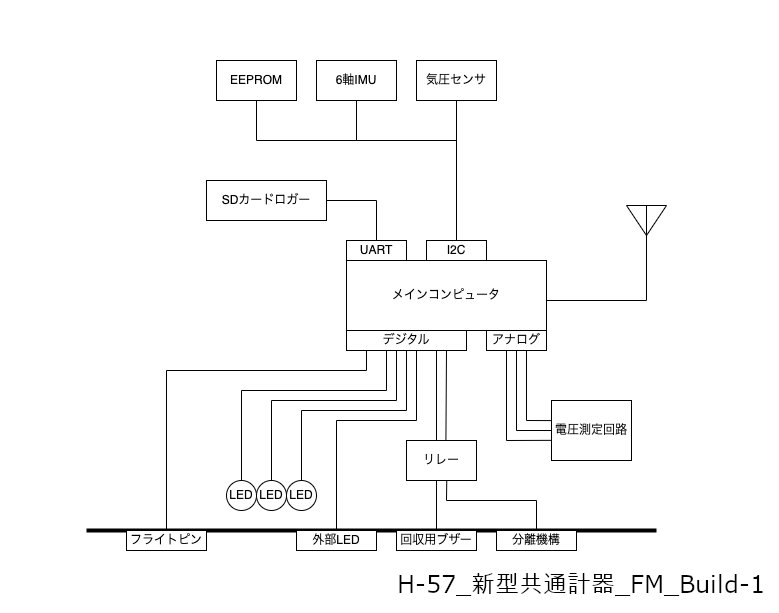
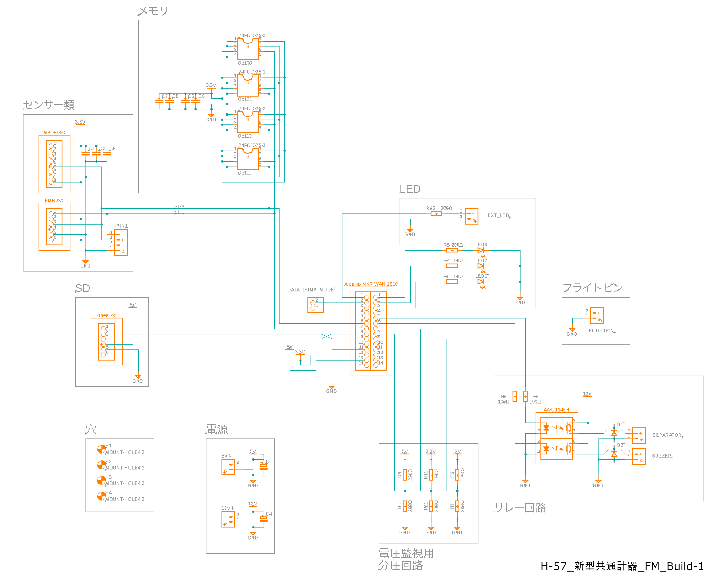
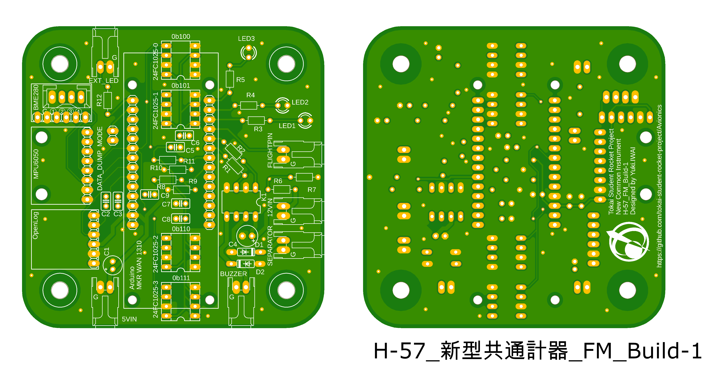

# ハードウェア

## ハードウェア概要

ブロック図

### メインコンピュータ

LoRaモジュールを搭載した**Arduino MKR WAN 1310**を使用します。

### EEPROM

データ保存用に**24FC1025-I/P**を4つ使用します。容量は計812KBです。

### 6軸IMU

**MPU6050**を使用します。加速度3軸+角速度3軸を計測できます。

### 気圧センサ

**BME280**を使用します。気圧, 気温, 湿度を計測できます。

### SDカードロガー

サブのデータ保存用に**SparkFun OpenLog**を使用します。

### フライトピン

Arduino内部のプルアップ抵抗とGNDが接続されています。接続が切れると離床として検知されます。

### LED

状態表示用に基板実装のLEDが3つ、外部LED1が1つあります。

### リレー

PhotoMOSリレーの**AQW214EH**を使用してArduinoの3.3Vデジタル出力で回収用ブザーと分離機構を動作させる12Vを制御します。

### 回収用ブザー

機体回収の補助用に大音響ブザーで音を鳴らします。

### 分離機構

**不知火Ⅲ**の電磁弁**HNB1-M5-DC12V**に接続されます。

### 電圧測定回路

3.3V回路電圧, 5V供給電圧, 12V供給電圧を監視します。

## 製造方法

回路図

ボード図

部品表  
[こちら](https://docs.google.com/spreadsheets/d/1n30Dj5v1OSRunuq7zoJ6woMFV0-FsNf8N-U6BEW_RTs/edit?usp=sharing)にもあります。
|品名|個数|基板マーク|備考|入手先|
|-|-|-|-|-|
|Arduino MKR WAN 1310|1|Arduino MKR WAN 1310|RoLaモジュールを搭載したArduino|[秋月](https://akizukidenshi.com/catalog/g/gM-16557/)|
|OpenLog|1|OpenLog|SDカードロガー|[SwitchScience](https://www.switch-science.com/products/2716)|
|MPU6050|1|MPU6050|6軸IMU|[Amazon](https://amzn.asia/d/aydRceh)|
|BME280|1|BME280|気圧, 気温, 湿度センサ|[秋月](https://akizukidenshi.com/catalog/g/gK-09421/)|
|24FC1025-I/P|4|24FC1025-0-3|EEPROM|[秋月](https://akizukidenshi.com/catalog/g/gI-03570/)|
|AQW214EH|1|K1|PhotoMOSリレー|[DigiKey](https://www.digikey.jp/short/tv22pwmr)|
|1N4007|2|D1-2|汎用整流用ダイオード|[秋月](https://akizukidenshi.com/catalog/g/gI-00934/)|
|赤色LED 3mm|2|LED1-2||[秋月](https://akizukidenshi.com/catalog/g/gI-11577/)|
|黄緑色LED 3mm|1|LED3||[秋月](https://akizukidenshi.com/catalog/g/gI-11637/)|
|電解コンデンサー 47μF|1|C1||[秋月](https://akizukidenshi.com/catalog/g/gP-03120/)|
|積層セラミックコンデンサー 0.1μF|3|C2, C6, C8||[秋月](https://akizukidenshi.com/catalog/g/gP-10147/)|
|積層セラミックコンデンサー 1μF|3|C3, C5, C7||[秋月](https://akizukidenshi.com/catalog/g/gP-08150/)|
|電解コンデンサー 100μF|1|C4||[秋月](https://akizukidenshi.com/catalog/g/gP-02724/)|
|積層セラミックコンデンサー 10μF|1|C9||[秋月](https://akizukidenshi.com/catalog/g/gP-08155/)|
|カーボン抵抗 1/4W 100Ω|5|R1-2, R5, R10, R12||[秋月](https://akizukidenshi.com/catalog/g/gR-25101/)|
|カーボン抵抗 1/4W 200Ω|3|R3-4, R9||[秋月](https://akizukidenshi.com/catalog/g/gR-25201/)|
|カーボン抵抗 1/4W 1.2kΩ|1|R6||[秋月](https://akizukidenshi.com/catalog/g/gR-25122/)|
|カーボン抵抗 1/4W 300Ω|1|R7||[秋月](https://akizukidenshi.com/catalog/g/gR-25301/)|
|カーボン抵抗 1/4W 220Ω|1|R8||[秋月](https://akizukidenshi.com/catalog/g/gR-25221/)|
|カーボン抵抗 1/4W 270Ω|1|R11||[秋月](https://akizukidenshi.com/catalog/g/gR-25271/)|
|DF1B-2P-2.5DS(1)|6|5VIN, 12VIN, SEPARATOR, BUZZER, FLIGHTPIN, EXT_LED|ヒロセ電機の水平2極コネクタ|[DigiKey](https://www.digikey.jp/short/73d4dz55)|
|DF1B-4P-2.5DSA(01)|1||ヒロセ電機の垂直4極コネクタ|[DigiKey](https://www.digikey.jp/short/nbfd2jqp)|
|ピンソケット 14P 1x14|2|||[秋月](https://akizukidenshi.com/catalog/g/gC-00653/)|
|ピンソケット 8P 1x8|1|||[秋月](https://akizukidenshi.com/catalog/g/gC-03785/)|
|ピンソケット 6P 1x6|2|||[秋月](https://akizukidenshi.com/catalog/g/gC-03784/)|
|ピンソケット 2P 1x2|1|||[秋月](https://akizukidenshi.com/catalog/g/gC-10097/)|
|ICソケット 8P|5|||[秋月](https://akizukidenshi.com/catalog/g/gP-00017/)|
|GSMダイポールアンテナ|1|||[秋月](https://akizukidenshi.com/catalog/g/gP-16733/)|
|プラスチックスペーサー M2x10mm|4||Arduino固定用|[秋月](https://akizukidenshi.com/catalog/g/gP-13017/)|
|プラスチックねじ M2x5mm|4||Arduino固定用|[秋月](https://akizukidenshi.com/catalog/g/gP-13020/)|
|プラスチック六角ナット M2|4||Arduino固定用|[秋月](https://akizukidenshi.com/catalog/g/gP-13019/)|

### 発注方法

[PCBgogo](https://www.pcbgogo.jp/)に発注します。1~2日でデータチェックが終わり、7日程で届きます。

金額は初期仕様なら10枚で$5、送料がDHLで$21でした。項目によってはデフォルトから変更すると金額が跳ね上がります。

PCBgogo  > 基板製作サービス > 自動お見積り  
の順番で進み、以下の仕様で見積作成をします。

デフォルトは**太字**

|項目|選択|備考|
|-|-|-|
|板材|**FR-4**|一般的なやつ|
|異種面付けの種類|**1**|1シートに何種類の基板があるか|
|外形寸法|80x80mm|設計によって変える|
|枚数|5 or 10|5枚でも10枚でも金額変わらん|
|面付け方法|**面付けなし**|気にしない|
|層数|**両面**|設計によって変える|
|FR4-TG|**KB6165F TG 150**|細かい素材|
|板厚|**1.6mm**|気にしなくていいと思う|
|最小パターン幅/間隔|**6/6mil**|気にしなくていいと思う|
|最小穴径|**0.3mm**|気にしなくていいと思う|
|レジスト|**緑**|基板の色 好きな色で|
|シルク|**白**|文字の色 Fusion360のNamesとValuesは印刷されないので注意|
|金端子|**なし**|グラボの刺すところみたいなイメージ|
|表面処理|**有鉛はんだ**|パッドのコーティングみたいなやつ 濡れ性に影響する 水溶性フラックス(OSP)がいいらしいけど高い|
|穴処理|**レジストカバー**|埋めにするとビアが埋まる|
|外層銅箔厚|**1oz**|パターンの厚さ|
|部品実装サービス|**なし**|自分でやればおけ|
|メタルマスク製作|**なし**|表面実装部品があるときはありの方がいいかも|

基板設計は[製造基準](https://www.pcbgogo.jp/Capabilities/FR_4_PCB_Capabilities.html)を参考にしてください。

[Buildフォルダ](./Build)にガーバーデータが保存されています。

---

©️ 1999 Tokai Student Rocket Project
