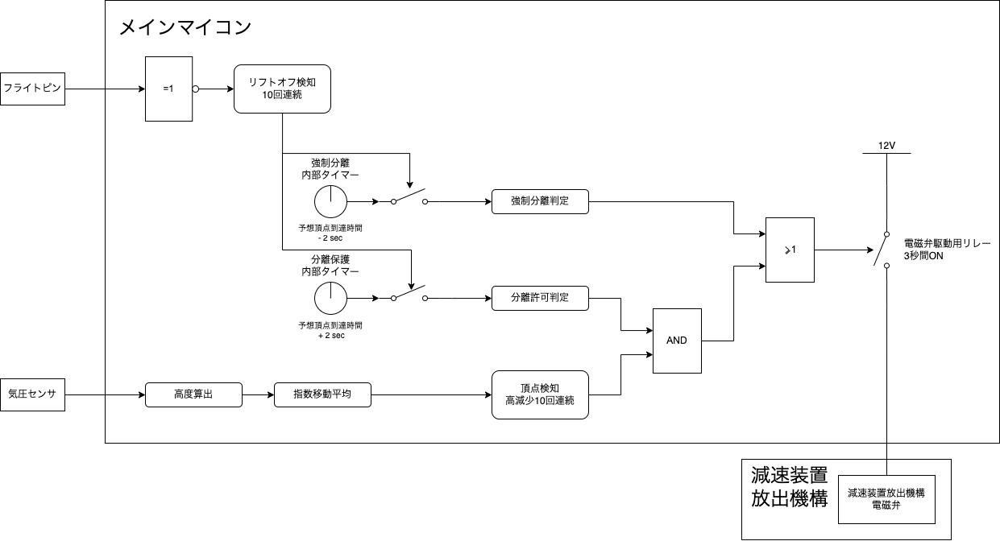

# 新型共通計器

## 目次

- [新型共通計器](#新型共通計器)
  - [目次](#目次)
  - [概要](#概要)
    - [目的](#目的)
    - [特徴](#特徴)
    - [成功基準](#成功基準)
  - [仕様](#仕様)
    - [ハードウェア](#ハードウェア)
    - [ソフトウェア](#ソフトウェア)
      - [計測データ](#計測データ)
      - [フライトモード](#フライトモード)
      - [分離ロジック](#分離ロジック)
      - [無線通信システム](#無線通信システム)
  - [運用方法](#運用方法)
    - [作業手順書](#作業手順書)
    - [起動モード](#起動モード)
      - [ログ読み出しモード](#ログ読み出しモード)
      - [ログ無しモード](#ログ無しモード)
    - [地上ソフトウェア](#地上ソフトウェア)
  - [生産者表示](#生産者表示)

## 概要

### 目的

- 分離機構に分離指令を送る
- 飛行データの取得と記録を行う

### 特徴

- マイコンにArduinoを採用

  → 拡張性・運用性・保守性が向上

- フライトモードによる指定高度分離

  → 落下分散範囲の縮小を期待できる

- 双方向無線通信システム

  → 地上ソフトウェアを介してコンフィグ設定・状態監視可能

### 成功基準

MINIMUM: タイマーによる強制分離  
FULL: 頂点分離  
ADVANCE: 双方向無線通信の正常動作

## 仕様

### ハードウェア

[こちら](./Hardware/README.md)を参照してください。

### ソフトウェア

プログラムの詳細は[こちら](./docs/ProgramDtails.md)を参照してください。

#### 計測データ

|データ|取得方法|
|-|-|
|加速度|MPU6050|
|角速度|MPU6050|
|姿勢角|加速度,角速度から算出|
|気圧|BME280|
|気温|BME280|
|高度|気圧,気温から算出|
|電圧(3.3V,5V,12V)|ArduinoのADC|

サンプリングレートは全て100Hzです。

<姿勢角算出>

Magdwickフィルタで算出します。
論文（["An efficient orientation filter for inertial and inertial/magnetic sensor arrays"](https://www.samba.org/tridge/UAV/madgwick_internal_report.pdf))もありますが、細かいことはわかりません。細かいことがわからなくてもライブラリがあるので大丈夫です。

ライブラリ  
[MagdwickAHRS(Github)](https://github.com/arduino-libraries/MadgwickAHRS)  
ライブラリの使い方  
[ArduinoのMadgwickライブラリの使い方 – imo Lab.](https://garchiving.com/how-to-madgwick-library-of-arduino/)

MPU6050にはDMP(Digital Motion Processor)という内部処理機構があり、ライブラリ([MPU6050_6Axis_MotionApps20](https://github.com/jrowberg/i2cdevlib/tree/master/Arduino/MPU6050))を使うことで簡単に姿勢角を算出することができますが、これ±2Gまでしか対応していないみたいです。なので代わりにMagdwickフィルタを使いました。

<高度算出>

気圧センサのBME280を抽象化したライブラリを使っています。この中に`readFloatAltitudeMeters()`があるので簡単に高度を算出できます。あらかじめ`setReferencePressure(float refPressure)`で基準気圧を設定する必要があります。デフォルトでは起動してから2秒後に計測した気圧を基準気圧として設定します。

ライブラリの中の高度を算出している式です。

```cpp
heightOutput = ((float)-44330.77)*(pow(((float)readFloatPressure()/(float)_referencePressure), 0.190263) - (float)1);
```

数式に直すとこんな感じ。

$$ h = -44330.77 \times \left( \left( \frac{P}{P_{0}} \right) ^{0.190263} - 1 \right) $$

$$ h : \text{高度[m]}, P : \text{計測気圧[Pa]}, P_{0} : \text{基準気圧[Pa]} $$

["International barometric height formula"](http://hyperphysics.phy-astr.gsu.edu/hbase/Kinetic/barfor.html)を使っているみたいです。対流圏(高度0kmから11km)で有効です。

ライブラリ  
[SparkFun_BME280_Arduino_Library(Github)](https://github.com/sparkfun/SparkFun_BME280_Arduino_Library)

気圧を取得する時は`readFloatPressure()`の前に`readTempC()`を呼び出す必要があります。

#### フライトモード

飛行の段階はフライトモードとして管理されます。フライトモードは条件を満たすと次のフライトモードに移行します。

|フライトモード|移行条件|
|-|-|
|STANDBY|起動時|
|THRUST|リフトオフ検知(フライトピン)|
|CLIMB|燃焼終了検知(タイマー)|
|DESCENT|頂点検知(高度)|
|PARASHUTE|分離許可判定(頂点検知,タイマー)|
|LAND|着地検知(タイマー)|

#### 分離ロジック

分離判定は**頂点検知+タイマー**です。



<頂点検知>

高度が連続で減少したことを検知して頂点とします。

気圧測定 → 高度算出 → 指数移動平均 → 連続降下検知 → 頂点検知

<指数移動平均>
[高度算出](#高度算出)で得た高度にはノイズが含まれているため指数移動平均で平滑化します。

$$ \mu = \mu_{ref} + \alpha \times \left( h - \mu_{ref} \right) $$

$$ \mu : \text{平均[m]}, \mu_{ref} : \text{前回の平均[m]}, \alpha : \text{平滑化定数}, h : \text{高度[m]} $$

平滑化は任意に設定する必要があります。0~1の範囲で大きいほど平滑化が強くなります。地上での試験では0.25が適切でしたが、こればっかりは打ち上げないとわからないです。

指数移動平均は前回の値1つを保存しておけば良いので、単純移動平均と比較して負荷が軽いという特徴があります。

<連続降下検知>  
平滑化した高度が連続で減少した回数をカウントします。連続なので1度でも減少しなければカウントはリセットされます。開発時は10回連続にしていますが、平滑化定数との兼ね合いもあるのでこればっかりは打ち上げないとわからないです。

<頂点検知>  
上昇中（[フライトモード](#フライトモード)がCLIMB）に連続降下検知がされた場合はフライトモードをDESCENTモードに変更します。同時にタイマーが分離保護時間を経過すれば、分離指令を出してフライトモードをPARASHUTEモードに変更します。

<タイマー>

タイマーではバックアップや検知の補助のために以下の時間を設定します。

- 想定燃焼時間
- 分離保護時間
- 強制分離時間
- 想定着地時間
  
<想定燃焼時間>  
モータの燃焼時間を設定します。今後、燃焼終了検知を実装した時の補助になります。

<分離保護時間>  
燃焼中や速度が速い段階で分離してしまうことを防ぎます。想定される頂点到達時間の-1~2秒を設定します。

<強制分離時間>  
落下中にパラシュートの許容速度以上に加速してしまうことを防ぎます。想定される頂点到達時間の+1~2秒を設定します。

<想定着地時間>  
ログの保存などの処理を終了する時間です。

<分離指令>

不知火の電磁弁([HNB1-M5-DC12V](https://jp.misumi-ec.com/vona2/detail/221000160046/))にDC12Vを3秒間供給します。信号の切り替えにはフォトリレー([TLP225A](https://akizukidenshi.com/catalog/g/gI-12192/))を使います。

DC12Vを不知火へ3秒間供給した後はブザーへ供給します。これは機体回収用でバッテリーが尽きるまで鳴り続きます。

#### 無線通信システム

_COMING SOON_

## 運用方法

### 作業手順書

[こちら](./docs/OperationProcedure.md)を参照してください。

### 起動モード

Arduinoの指定のピンとGNDを短絡させた状態で起動することで起動モードを変更できます。

※ DATA_DUMP_MODEのピンソケットは配線ミスで使えません。

#### ログ読み出しモード

**D7**ピンと**GND**を短絡

EEPROMに保存されたログをシリアル通信で出力します。ArduinoのUSBとPCを接続してシリアルモニタを起動してください。

|ボーレート|改行コード|
|-|-|
|115200|LF|

ログはcsv形式です。

```text:sample.csv
飛行時間,フライトモード,不知火3動作,ブザー動作,気圧,気温,高度,連続高度減少回数,X軸加速度,Y軸加速度,Z軸加速度,X軸角速度,Y軸角速度,Z軸角速度,ヨー,ピッチ,ロール,回路電圧,5V供給電圧,12V供給電圧
0.12,1,0,0,101088.91,18.94,1.44,0,-0.07,0.73,-0.49,-21.77,5.18,-22.50,230.71,4.35,118.50,3.30,4.95,0.02
0.14,1,0,0,101091.50,18.94,1.22,1,-0.07,0.74,-0.51,-44.21,10.00,-12.13,230.87,4.41,118.16,3.30,4.93,0.02
0.16,1,0,0,101090.66,18.94,1.08,2,-0.10,0.76,-0.49,-56.71,17.32,-1.65,231.03,4.38,117.69,3.30,4.93,0.02
0.18,1,0,0,101094.08,18.94,1.01,3,-0.10,0.77,-0.43,-62.32,19.33,2.13,231.20,4.35,117.15,3.30,4.93,0.02
0.20,1,0,0,101093.24,18.94,1.08,4,-0.10,0.78,-0.38,-61.59,14.94,2.50,231.32,4.34,116.49,3.30,4.92,0.03
```

#### ログ無しモード

**D8**ピンと**GND**を短絡

EEPROMとSDロガーへのログ保存を行わないモードです。EEPROMの書き込み回数を温存したい時に使用します。

---

### 地上ソフトウェア

_COMING SOON_

## 生産者表示

```text
                                    ....
                              .dMMMMMMMMMNa,,
                             .MMMMMMMMMMMMMMMML
                            dMMMMMMMMMMMMMMMMMMh
                           ,MMMMBwtttwXWHMMMMMMMb
                           (MMM8rrtttttrwUHMMMMMM[
                           -MM#zzwOOzzOwwwwXMMMMMM;
                           .MMHWHMMMkXXWHHUXUXWMMMN
                            MMuXQQNkUZwXWMMMNXudMM#
                            JMuVwvzwOC+7COwrrrzuMMF
                             qzZ11>>>>;>>>>>>?vVWWL
                             (Oz?>>??>><>;>>>?=OWSI
       私が作りました>       .v=?1>??====<>+1??+kX'
                              !z11??=11?????++=d\
                               (Orzlll=???=zz=zO
                               .?OOv1??====zvOd}
                                  ?Zwz=llzOzzXXI
                                   XkQqHHkWWWXuuMMM;
                                   mWWHHmHWuzzzuqNMMMMN,
                               .dMMNmyVWHWyXXXQMMMMMMMMMNg,
                               MMMMMMMkWVVWqMMMMMMMMMMMMMMMMNJ.
                            .gMMMMMMMMMMNMMMMMMMMMMMMMMMNkwtMMMMa,.
                        ..MMMMMMMMMMMNMNMMMMMMMMMMMMMMMMMMmXr?MMMMMN,
                     .MMMMMMMMMMMMMMMMMMMMMMMMMMMMMMMMMMMMMNOlzMMMMMM,
             ..    .MMMMMMMMMMMMMMMMMMMMMMMMMMMMMMMMMMMMMMMMNwtlTEOlXM,
           .lO2   .MMMMMMMMMMMMMMMMMMMMMMMNMMMMMMMMMMMMMBAZ+WWwttXwOlON.
          .tOZ`  .MMMMMMMMMMMMMMMMMMMMMMMMMMMMMMMMMMMMMNQkQOrwWXttWwllvN
        ..lzZ`  .MMMMMMMMMMMMMMMMMMMMMMMMMMMMMMMMMMMMMMMMMRwOtwXXttlllllL
     JlzOlzd^   dMMMMMMMMMMMMMMMMMMMMMMMMMMMMMMMMMMMMMMMMMKlOOtOwvOllltlw;
    ==zOlzw! . .MMMMMMMMMMMMMMMMMMMMMMMMMMMMMMMMMMMMMMMMMMNOtltOlOrOzOQkNN,
  .1=zZlzwynOlOMMMMMMMMMMMMMMMMMMMMMMMMMMMMMMMMMMMMMMMMMMM#XwQmmQQQQNRWNMMb
 .===zlOwZO=lz1=dMMMMMMMMMMMMMMMMMMMMMMMMMMMMMMMMMMMMMMMMMMHWMHMMMMMMMMMMMMp
 OllllttOllzv==zMMMMMMMMMMMMMMMMMMMMMMMMMMMMMMMMMMMMMMMMMMMMNMHMMMMMMMMMMMMM|
 .4kzzzl=lzz=zzwMMMMMMMMMMMMMMMMMMMMMMMMMMMMMMMMMMMMMMMMMMMMMMMM#MMMMMMMMMMMM,
   ,MNmgmQQmmkkXMMMMMMMMMMMMMMMMMMMMMMMMMMMMMMMMMMMMMMMMMMMMMMMMMMMMMMMMMMMMMb
    .MMMMMMH@HHHMMMMMMMMMMMMMMMMMMMMMMMMMMMMMMMMMMMMMMMMMMMMMMMMMMMMMMMMMMMMMM,
    ,MMMMMMMMMMMMMMMMMMMMMMMMMMMMMMMMMMMMMMMMMMMMMMMMMMMMMMMMMMMMMMMMMMMMMMMMM%
     ?MMNHqHMMMMMMMMMMMMMMMMMMMMMMMMMMMMMMMMMMMMMMMMMMMMMMMMMMMMMMMMMMMMMMMMMM;
      MMMMNMMMMMMMMMMMMMMMMMMMMMMMMMMMMMNMMMMMMMMMMMMMMMMMMMMMMMMMMMMMMMMMMM#db
```

---

©️ 1999 Tokai Student Rocket Project
