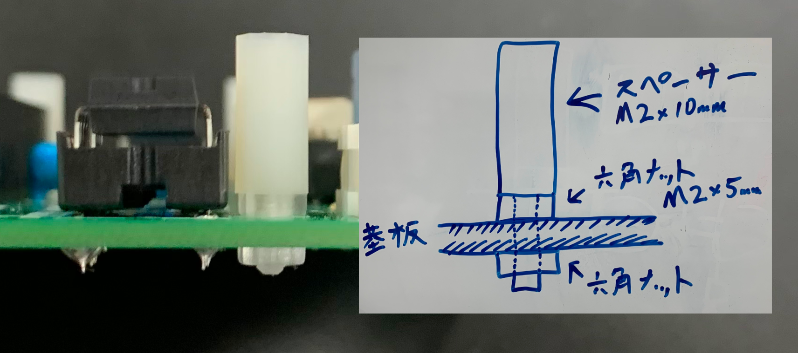
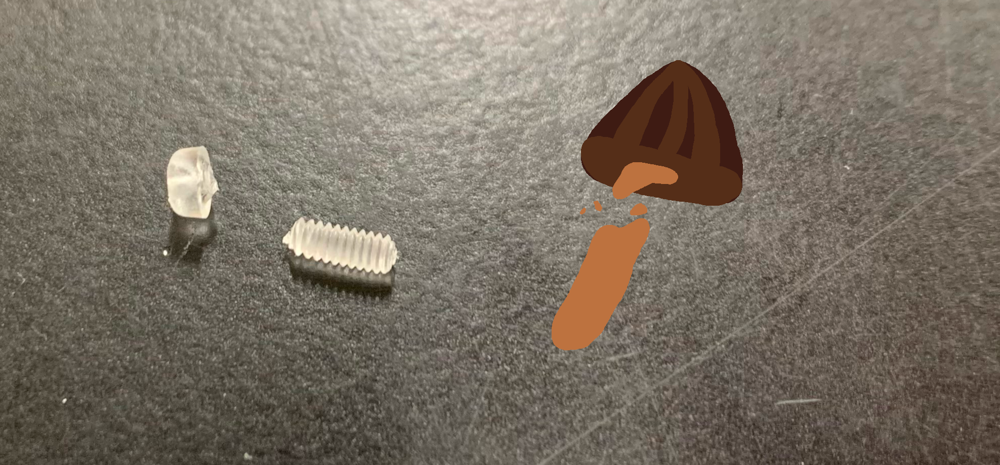
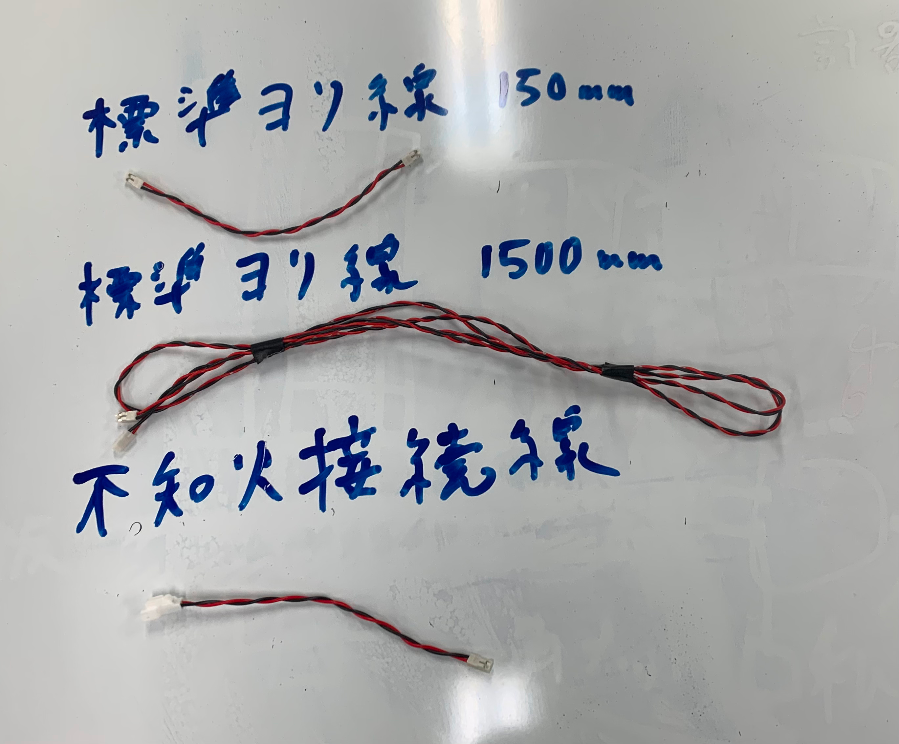

# 作業手順書

## 1. 搭載方法

### 1.1. 基板の確認

基板に全ての部品が実装されているか確認します。

以下の項目を確認してください。フォトリレーやEEPROMなどのICソケットにはめる部品は向きに注意してください。

- フォトリレー(白い4本足)が2個 K1 にはまっていること
- EEPROM(黒い8本足)が4個 24FC1025 にはまっていること
- プラスチックスペーサーが4個付いていること
- そのほか部品が全て付いていること

プラスチックスペーサーは下の図のように付けてください。

### 1.2. Arduinoの取り付け

基板中央の14連ピンヘッダにArduino MKR WAN 1310を取り付けます。

Arduinoの4箇所の穴と基板のスペーサーの位置を合わせてください。

奥まで刺したら、M2プラスチックネジで固定してください。

ねじ止めはトルクをかけすぎると、きのこの山よろしく頭が取れるので気をつけてください。

### 1.3. プログラムの書き込み

ArduinoのMicro-USB端子とPCを接続してください。

以下のプログラムを書き込んでください。

[FlightComputer.ino](https://github.com/tokai-student-rocket-project/Avionics/blob/main/FlightComponents/CommonInstrument/FlightComputer/FlightComputer.ino)

Arduinoの黄色LEDが2Hzで点滅すれば正常に動いています。この段階ではフライトピンが接続されていないため、離床したと勘違いして基板の状況表示LEDが点灯します。

### 1.4. 計器タワーへの搭載

M4x25mmスペーサーを使用して、他の基板と一緒に計器タワーに搭載します。簡単でしょ？

基板端の黒い印の位置を合わせてください。

|基板の順番|
|-|
|テレメーター基板|
|サーボコントローラー基板|
|変圧基板|
|共通計器基板|
|電池ボックス基板|

### 1.5. 接続

使う線
|種類|長さ|本数|コネクタ|
|-|-|-|-|
|標準ヨリ線150mm|150mm|3|DF1B-2S-2.5R DF1B-2S-2.5R|
|標準ヨリ線1500mm|1500mm|1|DF1B-2S-2.5R DF1B-2S-2.5R|
|フライトピン機体側|1500mm|1|DF1B-2S-2.5R SYR-02T|
|フライトピン地上側|300mm|1|SYP-02T-1|
|不知火接続線|150mm|1|DF1B-2S-2.5R DF1BA-2EP-2.5RC|

#### 1.5.1. 電源

2 x 標準ヨリ線150mm

- 5VINコネクタと変圧基板の5V出力を接続する
- 12VINコネクタと変圧基板の12V出力を接続する

#### 1.5.2. フライトピン

1 x 標準ヨリ線1500mm  
1 x フライトピン機体側  
1 x フライトピン地上側

- FLIGHTPINコネクタとフライトピン機体側を接続する
- フライトピン機体側とフライトピン地上側

#### 1.5.3. 外部LED

1 x 標準ヨリ線150mm

- EXT_LEDコネクタと外部LEDを接続する

#### 1.5.3. 周辺機器

1 x 不知火接続線

- SEPARATORコネクタと不知火を接続する
- BUZZERコネクタと回収ブザーを接続する

---

ご不明な点はエレキ岩井まで。
