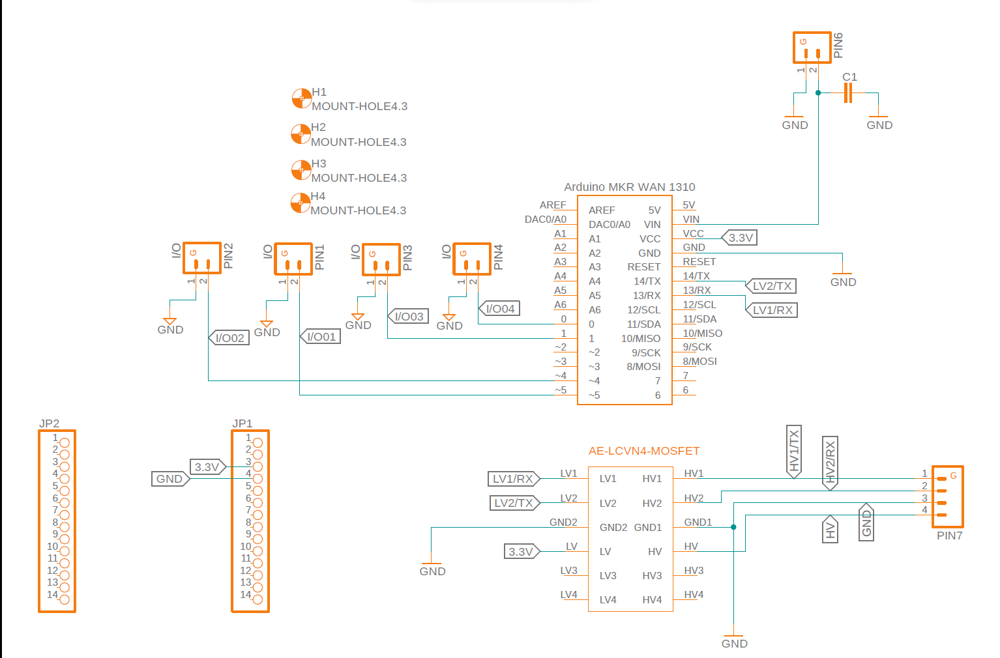
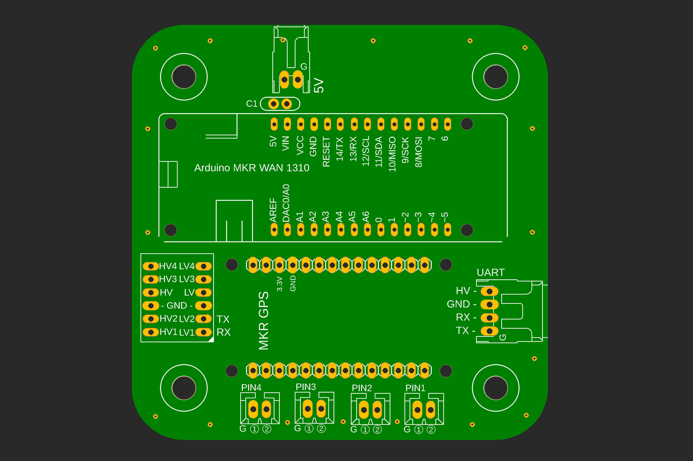
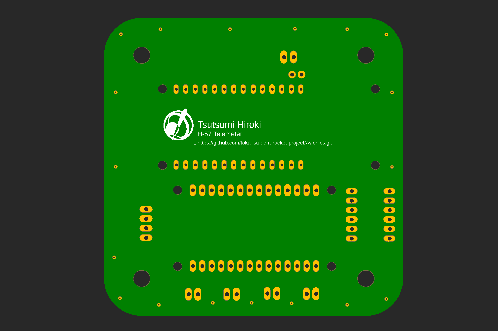

# ハードウェア

## ハードウェア概要

## テレメトリー基板
***
### ブロック図
<!--ここにブロック図を挿入-->
^_^ 工事中

### マイコン

- LoRaモジュールを搭載した**Arduino MKR WAN 1310**を使用します。

### GNSS

- **MKR GPS Shield** を使用します。

### ４ビット双方向ロジックレベル変換モジュール

- 秋月電子のAE-LCNV4-MOSFET(BSS138)を使用しています。
  - MKR WAN 1310 が3.3V系、Arduino NANO が5.0V系のためその変換に使用しています。

### 回路図

### ボード図

上側

下側

部品表
|名称|個数|シルク|入手先|備考|
|-|-|-|-|-|
|Arduino MKR WAN 1310|1|Arduino MKR WAN 1310|[秋月](https://akizukidenshi.com/catalog/g/gM-16557/), [Digi-Key](https://www.digikey.jp/ja/products/detail/arduino/ABX00029/10638307?s=N4IgTCBcDaIIICcAmBXAlgOwPYAICyA0gEo4CMAzKQAw4gC6AvkA)|[専用アンテナ](https://akizukidenshi.com/catalog/g/gP-16733/)も一緒に購入してください。
|Arduino MKR GPS Shield|1|MKR GPS|[Digi-Key](https://www.digikey.jp/ja/products/detail/arduino/ASX00017/9990414), [マルツ](https://www.marutsu.co.jp/pc/i/32998936/), [RS](https://jp.rs-online.com/web/p/shields-for-arduino/1894522)||
|GSM ダイポールアンテナ（Arduino MKR WAN用アンテナ）|1|なし|[秋月](https://akizukidenshi.com/catalog/g/gP-16733/)|Arduino MKR WAN 1310へ取り付ける。|
|コンデンサー|1|C1|[秋月](https://akizukidenshi.com/catalog/g/gP-13582/)|TSRPの在庫多数有り。パスコン。|
|レベル変換|1|忘れた...（HV4,LV4...の記載がある箇所）|[秋月](https://akizukidenshi.com/catalog/g/gK-13837/)|Arduino NANO とMKR WAN 1310で通信する際のレベル変換用|
|DF1BZ-2P-2.5DS（ベース付きポスト）|1|5V|[Digi-Key](https://www.digikey.jp/ja/products/detail/hirose-electric-co-ltd/DF1BZ-2P-2-5DS/1033129), [MiSUMi](リンクを挿入)|
|DF1BZ-4P-2.5DS（ベース付きポスト）|1|UART|[Digi-Key](https://www.digikey.jp/ja/products/detail/hirose-electric-co-ltd/DF1BZ-4P-2-5DS/1033131)|
|ピンヘッダ1×14|2|MKRWAN1310の箇所|[秋月](https://akizukidenshi.com/catalog/g/gC-00653/)||

***

## バルブコントローラー基板

### ブロック図
<!--ここにブロック図を挿入-->
^_^ 工事中

### マイコン

- Arduino NANO を使用します。

### アクチュエーター

- RS-405CBを使用します。
  - 2023年に後継機種が発売される可能性あり。

部品表
|名称|個数|シルク|入手先|備考|
|-|-|-|-|-|
|Arduino NANO|1|忘れた...（TX,RX,RST...がある場所|[秋月](https://akizukidenshi.com/catalog/g/gM-09059/)|
|電解コンデンサー|2|C1, C2|[秋月](https://akizukidenshi.com/catalog/g/gP-03129/)|
|コンデンサー|1|C3|[秋月](https://akizukidenshi.com/catalog/g/gP-13582/)|パスコン|

