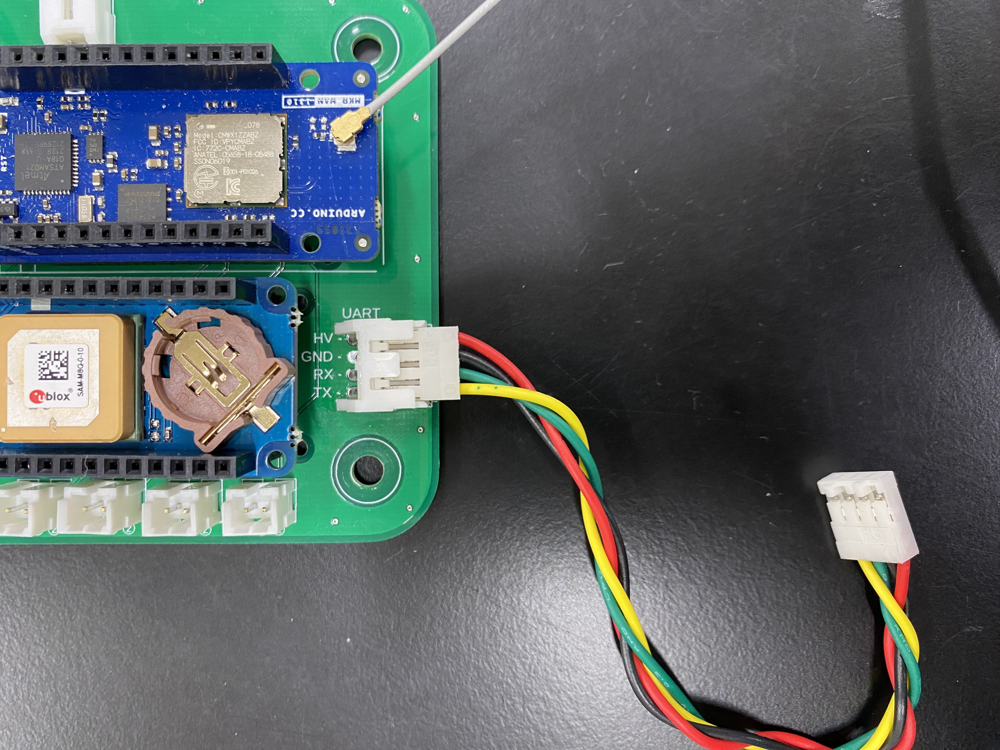
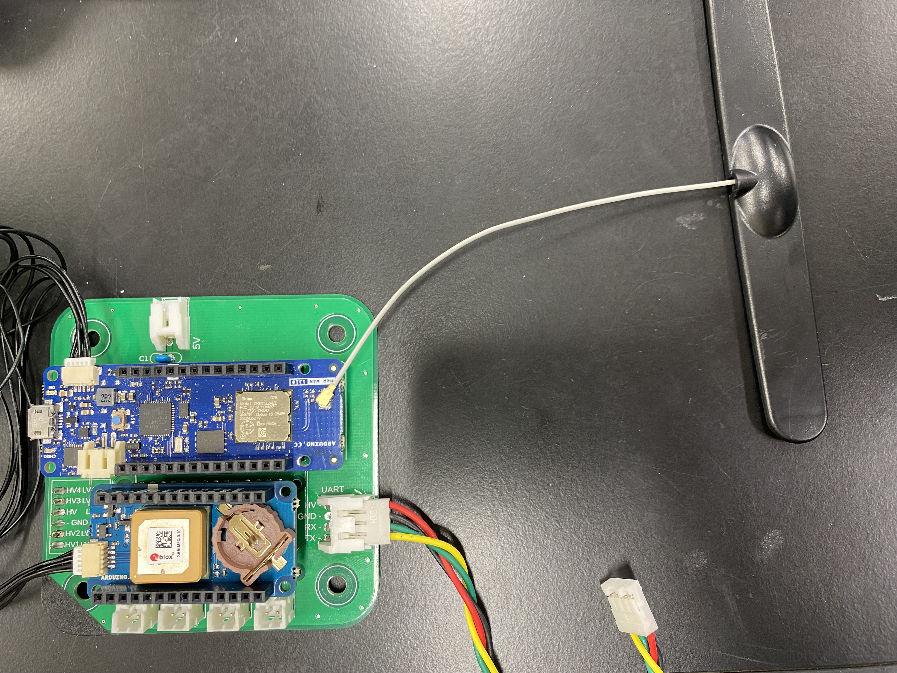
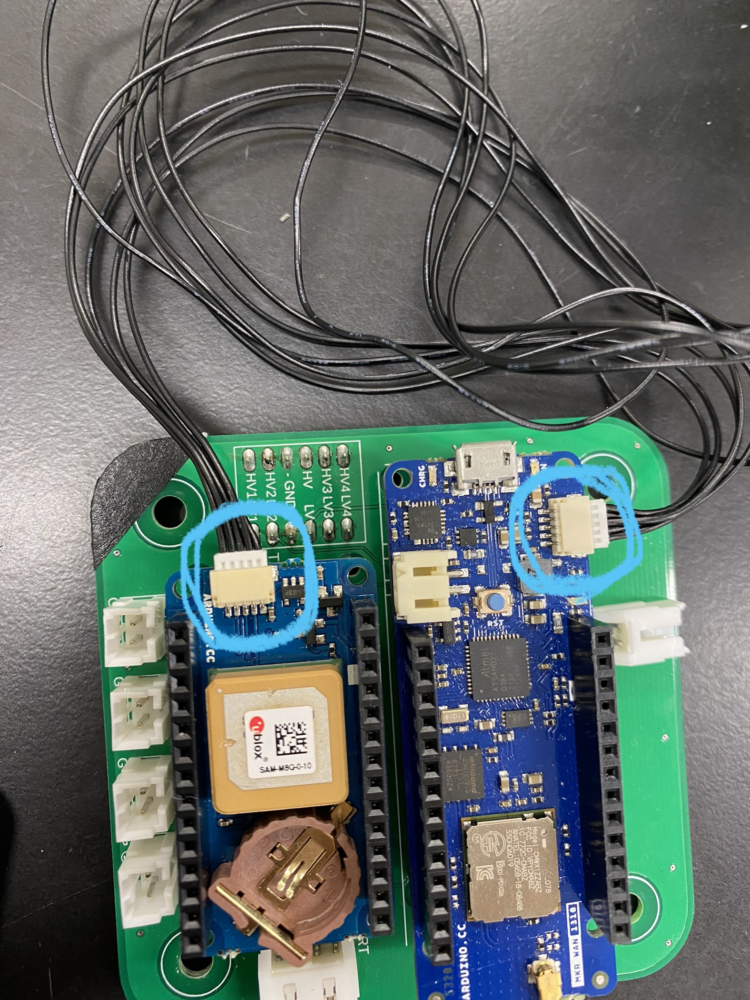

# 遠隔測定モジュール作業手順書

1. 計器タワーを組み立て
   - 用意するもの
     - 遠隔測定モジュール
     - M4×25mmのスペーサー 
       - 1基板当たり × 4
> 右上に黒色の印を向け組み立てる
> 
>
***

2. UARTケーブルの接続
   - 用意するもの
     - UART用4線ケーブル × 1
       - 色の配置：1- 黄,緑,黒,赤 -4
> 基本的に外すことはないのでもしも外れていたらこの手順を踏む。
> 
>
***

3. 状態確認LEDの接続
    - 用意するもの
      - LED付きケーブル × 2
        - UART接続確認用LED(緑)
        - GPS受信確認用LED(青)
> PIN1 : UART接続確認用LED
> 
> PIN2 : GPS受信確認用LED
> 
> 
>
***

4. アンテナの接続
   - 用意するもの
     - MKR WAN 1310用ダイポールアンテナ × 1
> MKR WAN 1310へダイポールアンテナを写真の箇所へ接続する。
> 
> 
>  

5. MKR GPS Shieldの接続
   - 用意するもの
     - MKR GPS Shield用ケーブル × 1
> MKR WAN 1310とMKR GPS Shield用ケーブルが接続されていない場合にこの手順を踏む。
>
> 青色の円で囲まれた箇所に接続する。
>
> 上下の向きがあるので気をつけて接続する。
>
> うまく入らない時は落ち着いて向きを確認すること。
> 
>  

6. 電源ポートの接続
   - 用意するもの
     - ピン数2のコネクタ付きケーブル × 1
> 5Vのシルクがある箇所に接続する
> 
> !!! 注意 !!! 
>
>
> 電源基板への接続は5.0V出力ピン以外の箇所にしないこと
> 
> 
>
***

