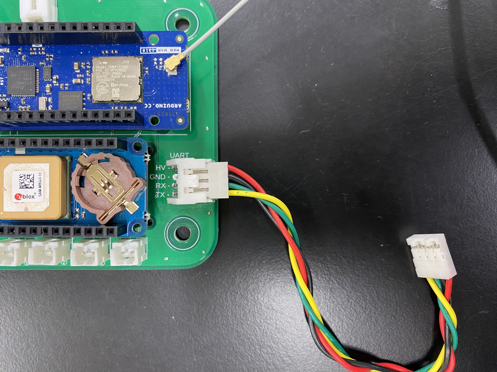
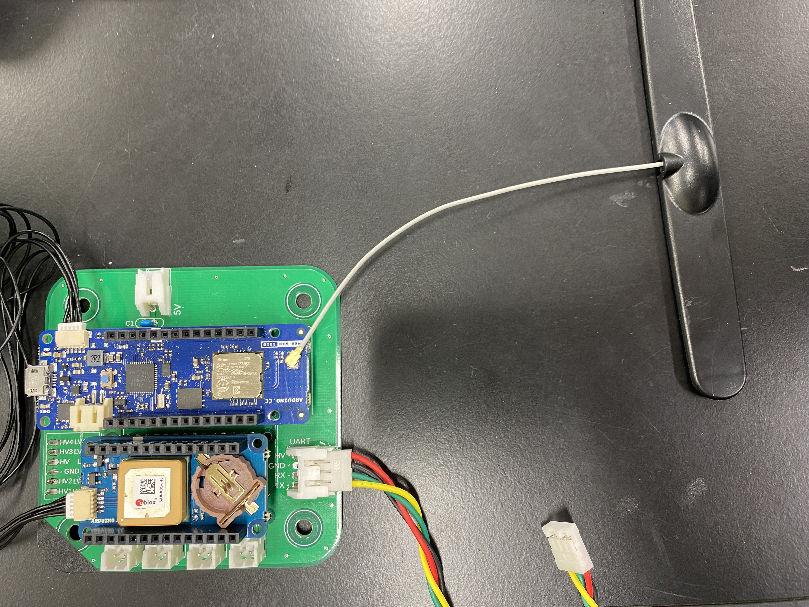
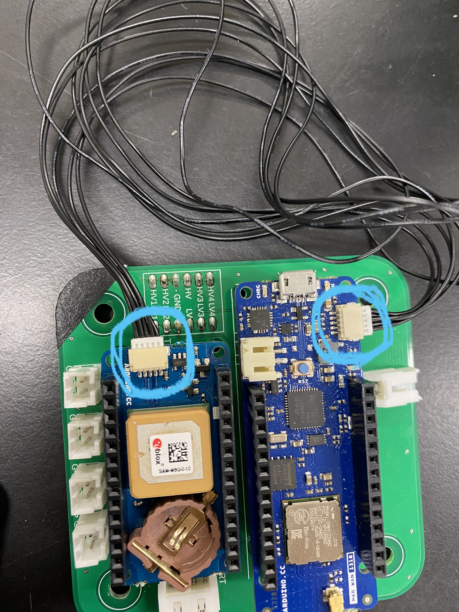

# テレメトリー基板作業手順書

## 1. UARTケーブルの接続
   - 用意するもの
     - UART用4線ケーブル × 1

UARTと記載のあるところにUARTケーブルを接続する。
入らないときは向きを確認して落ち着いて作業すること。

> 基本的に外すことはないのでもしも外れていたらこの手順を踏む。
>
> [4] HV(***H***igh ***V***oltage) : 赤
> 
> [3] GND(***G***ou***ND***) : 黒
>
> [2] RX(***R***eceiver) : 緑　※xは省略の意味
>
> [1] TX(***T***ransmitter) : 黄　※xは省略の意味
>
> 
>
***

## 2. 状態確認LEDの接続
  - 用意するもの
    - LED付きケーブル × 2
      - UART接続確認用LED(***緑***)
      - GPS受信確認用LED(***青***)

PIN1にUART接続確認用LEDを接続する。
入らないときは向きを確認して落ち着いて作業すること。

PIN2にGPS受信確認用LEDを接続する。
入らないときは向きを確認して落ち着いて作業すること

> PIN1 : UART受信確認用LED
> 
> PIN2 : GPS受信確認用LED
>
> PIN3 : NC(Not Connect)
>
> PIN4 : NC(Not Connect)
> 
> 
>
***

## 3. アンテナの接続
   - 用意するもの
     - MKR WAN 1310用ダイポールアンテナ × 1

MKR WAN 1310へダイポールアンテナを写真の箇所へ接続する。このほかに取り付ける箇所はないので落ち着いて作業すること。

奥まで入るように注意して接続すること。

> このダイポールアンテナはMKRWAN1310専用品となっているので確認がとれない場合は専用品を用いること。
> 
> 
>  

## 4. MKR GPS Shieldの接続
   - 用意するもの
     - MKR GPS Shield用ケーブル × 1

青色の円で囲まれた箇所に接続する。
上下の向きがあるので気をつけて接続する。

うまく入らない時は落ち着いて向きを確認すること。無理に押し込むと端子を破壊する可能性がある。

> MKR WAN 1310とMKR GPS Shield用ケーブルが接続されていない場合にこの手順を踏む。
> 
>  
> 

## 5. 電源ポートの接続
   - 用意するもの
     - ピン数2の2線ケーブル × 1

5Vと記載のある箇所に接続する。

一つの方向にしか入らないため落ち着いて作業すること。

> 
> 
> ***!!! 注意 !!!***
>
> ***!!! 電源基板への接続はまだ行わないこと !!!***
> 
> 
>
***

## 6. 基板タワーの組み立て
   - 用意するもの
     - M4×25mmのスペーサー 
       - 1基板当たり × 4
     - 本基板

以下の順番になるように基板タワーを作成する。

| 基板の順番                   |
| ---------------------------- |
| テレメーター基板 **←今ここ** |
| バルブコントローラー基板     |
| 変圧基板                     |
| 共通計器基板                 |
| 電池ボックス基板             |

右上に黒色の印を向け組み立てる。

> 
> 
>
***

## 7. 電源を入れる
  - 用意するもの
     - 基板タワー

> 電源基板の **5.0V** 出力ピンに「5. 電源ポートの接続」で接続したケーブルを挿入する。
> 
> （写真では分かりやすくするためにタワーを組んでいない状態となっている。）
>
> !!! 注意 !!!
> 
> !!! **12.0, 9.0V出力ピンへ挿入しないこと** !!!
> 
> 
>

***
# 8. ヨシ！

**最終確認を行う。**

***

