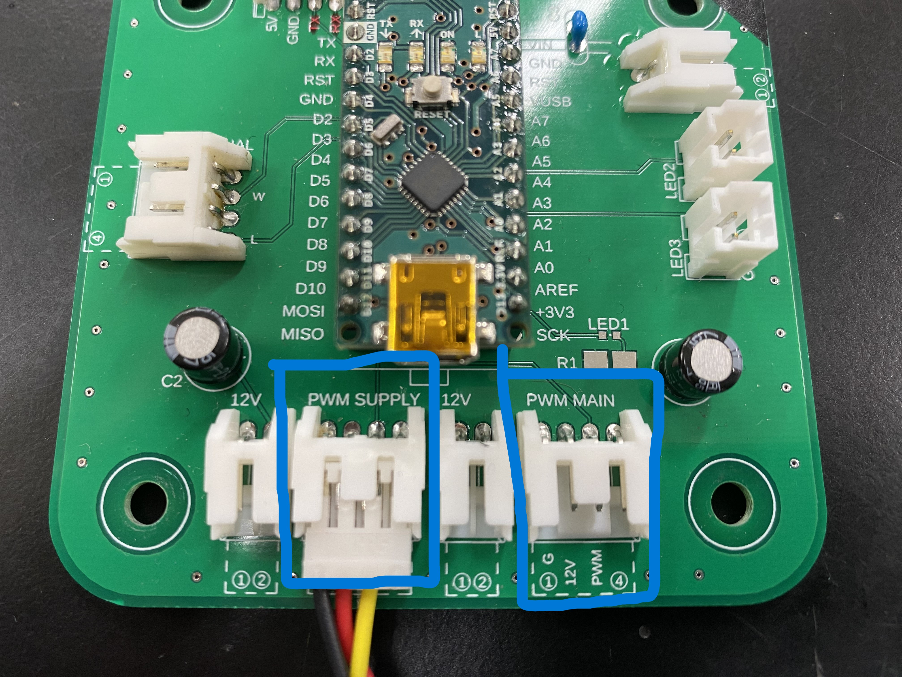
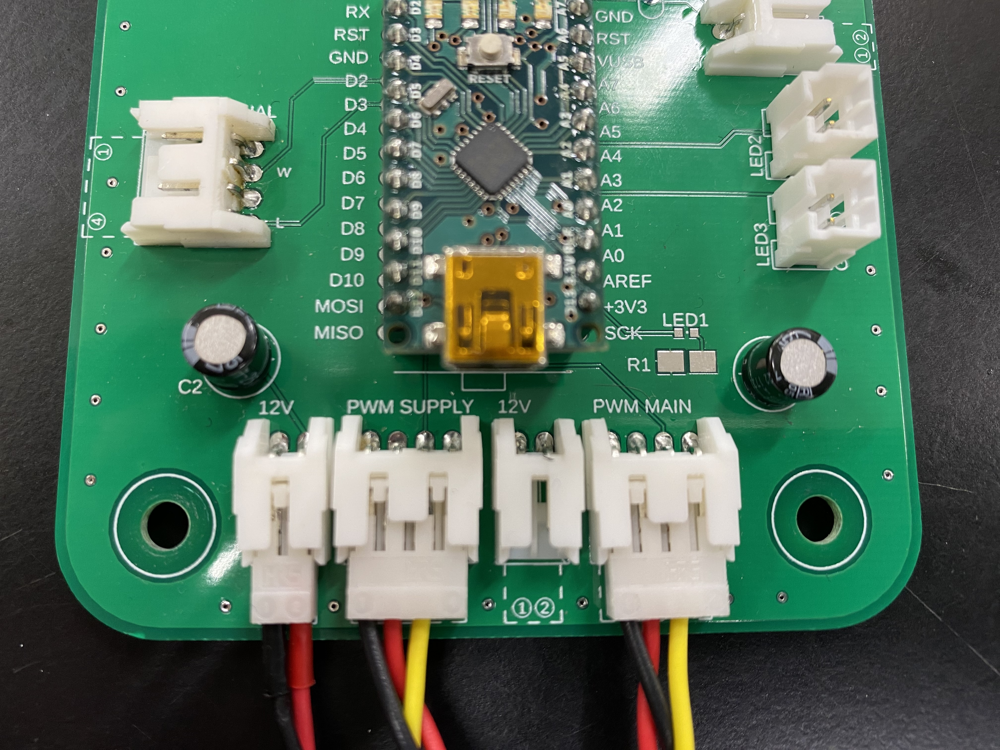
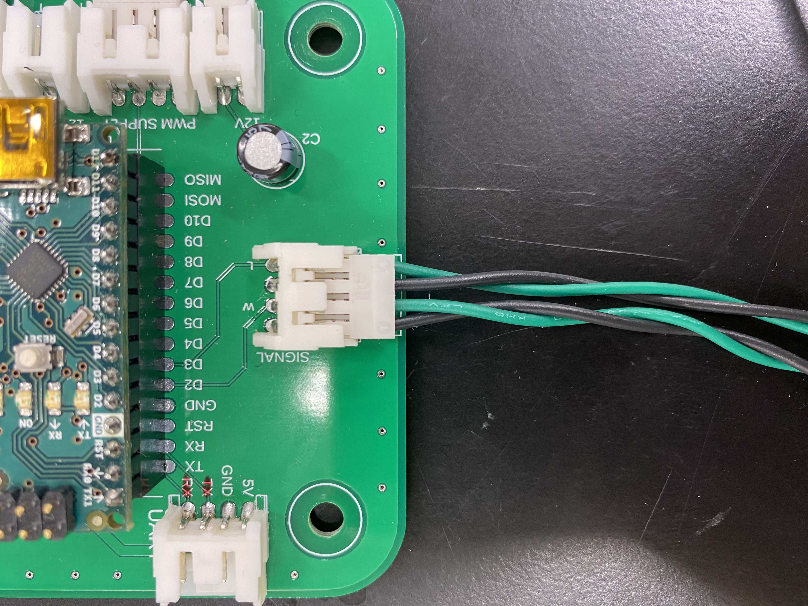
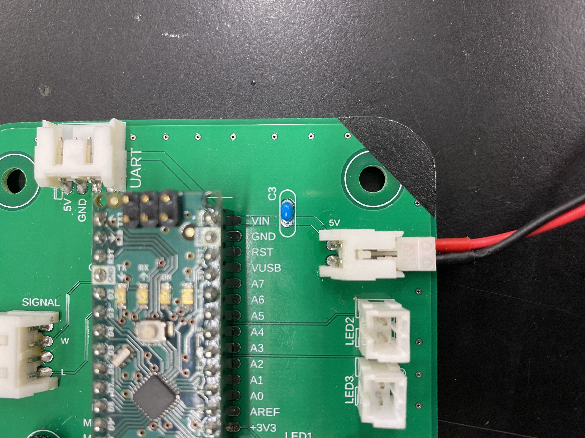
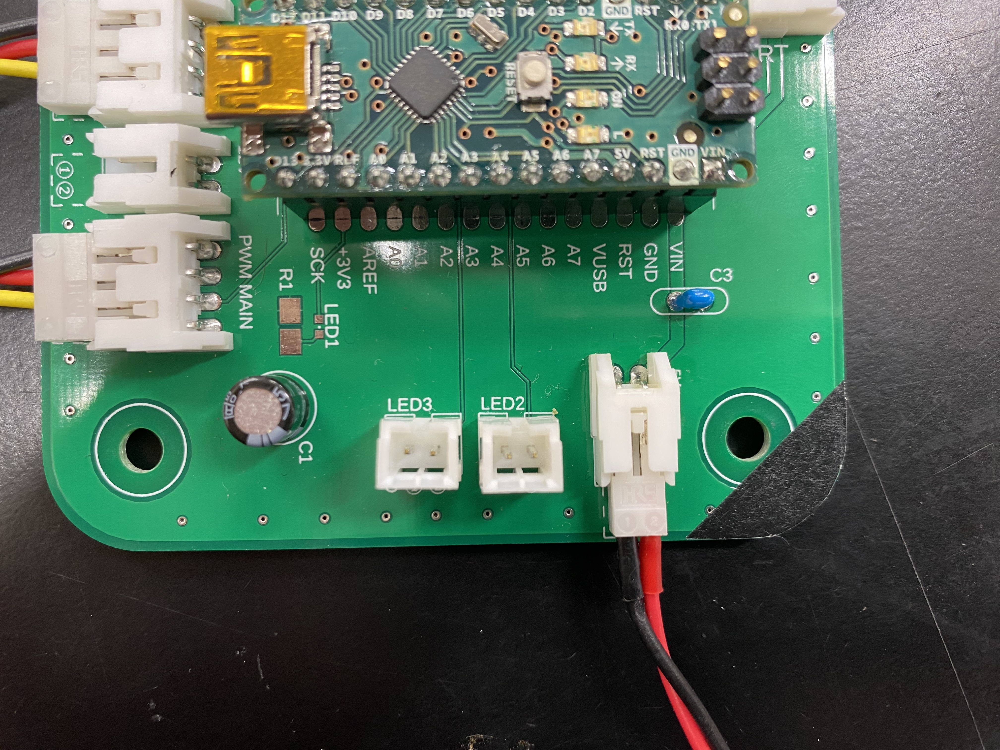
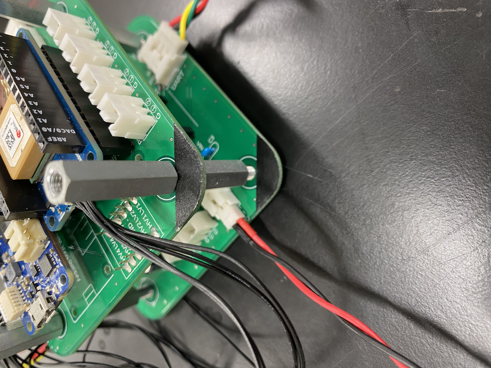
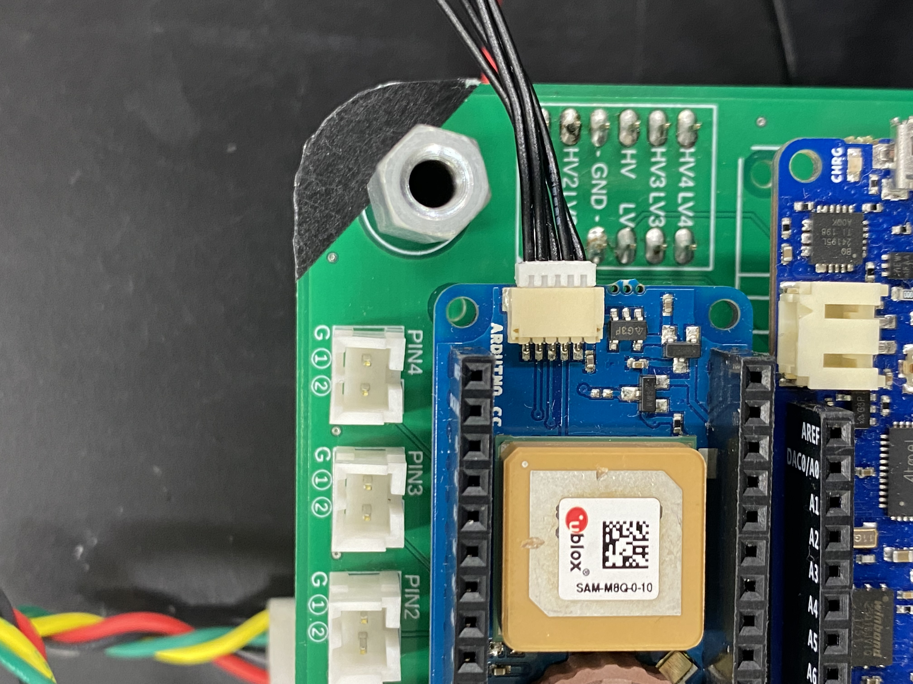
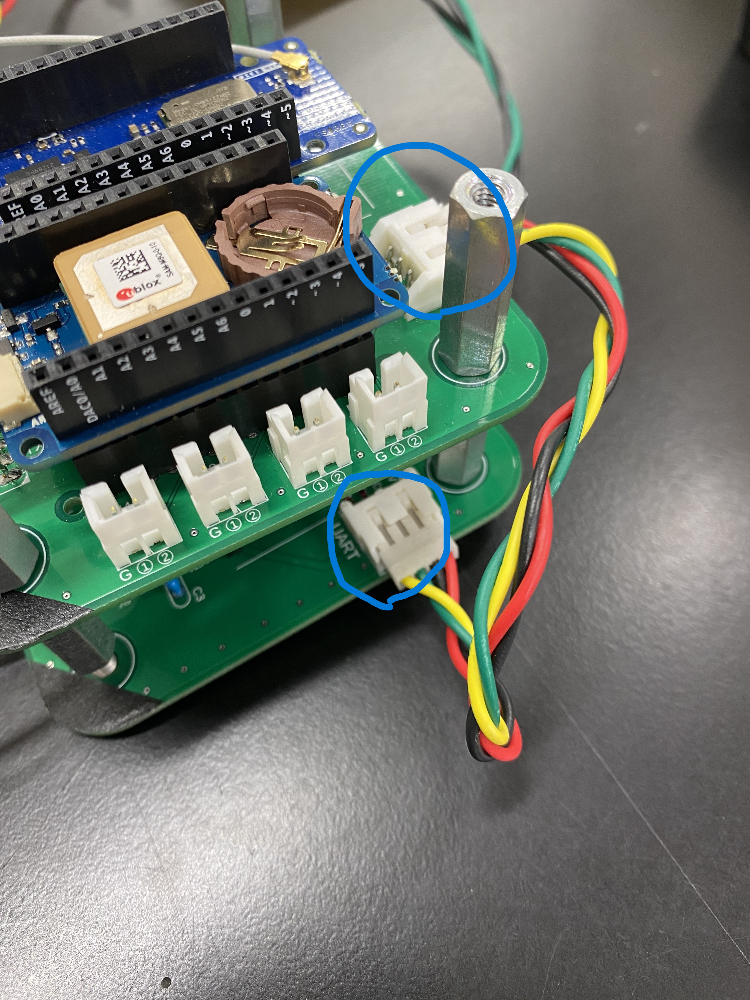

# バルブコントローラー基板作業手順書

## 1. PWMケーブルの接続
   - 用意するもの
     - ピン数4の3線ケーブル × 2
       - ハウジング [EHR-4] & [DF1B-4S-2.5R] 

**PWM SUPPLY** と記載があるところに3線ケーブルの *DF1B-4S-2.5R* 側を接続する。
入らないときは向きを確認して落ち着いて作業すること。

**PWM MAIN** と記載があるところに3線ケーブルの *DF1B-4S-2.5R* 側を接続する。
入らないときは向きを確認して落ち着いて作業すること。

> 青枠で書かれたところに接続をすること
>
> 写真では片方にしか接続されていないが両方に接続すること
> 
> 
>

- [ ] :point_left:ヨシ！ PWMケーブルの接続 

***
## 2. サーボ用電源用ケーブルの接続
  - 用意するもの
    - ピン数2の2線ケーブル × 2
      - ハウジング [DF1B-2S-2.5R] & [DF1B-2S-2.5R]

**12V**と記載がある箇所へピン数2の2線ケーブルを接続する。

***まだ、電源基板との接続は行わないこと。***

> 写真では片方にしか接続されていないが両方に接続すること。
> 
>

- [ ] :point_left:ヨシ！ サーボ用電源用ケーブルの接続

***
## 3. 信号用ケーブルの接続
  - 用意するもの
    - ピン数4の4線ケーブル × 2
      - ハウジング [DF1B-4S-2.5R] & [DF1B-4S-2.5R]

**SIGNAL**と記載がある箇所へピン数4の4線ケーブルを接続する。
入らない時は向きを確認して落ち着いて作業すること。

> <!--4線ケーブルの色を変更する可能性があるので写真を差し替える。-->
> 
>

- [ ] :point_left:ヨシ！ 信号用ケーブルの接続

***
## 4. 電源用ケーブルの接続
  - 用意するもの
    - ピン数2の2線ケーブル × 1
      - ハウジング [DF1B-2S-2.5R] & [DF1B-2S-2.5R]

**5V**と記載のある個所へピン数2の2線ケーブルを接続する。
入らないときは向きを確認して落ち着いて作業すること。

***まだ、電源基板との接続は行わないこと。***

>
> 
>

- [ ] :point_left:ヨシ！ 電源用ケーブルの接続

***
## 5. 確認用LEDケーブルの接続
  - 用意するもの
    - LED付きケーブル × 2
      - Waiting Mode用 (緑) × 1
      - Launch Mode用 (赤) × 1

**LED2** にLED付きケーブル(赤)を接続する。

**LED3** にLED付きケーブル(緑)を接続する。

>
> 
> 

- [ ] 確認用LEDケーブルの接続

***
## 6. これまでに接続したケーブルの確認
  - 用意するもの
    - 確認をする意思

以上の手順までに接続したケーブルが接続されているか確認する。

- [ ] :point_left:ヨシ！ これまでに接続したケーブルの確認

***
## 7. 基板タワーの作成
  - 用意するもの
    - M4×25mmスペーサー
      - 1基板当たり × 4
    - 本基板

以下の順番になるように基板タワーを作成する。

|基板の順番|
|-|
|テレメーター基板|
|バルブコントローラー基板　**←今ここ**|
|変圧基板|
|共通計器基板|
|電池ボックス基板|

右上に黒色の印を向け組み立てる。

> テレメーター基板とバルブコントローラー基板を組み合わせた様子
> 
> 
>
> 黒色の印を他の基板と合わせて組み立てる
> 
> 
>

- [ ] :point_left:ヨシ！ 基板タワーの作成

***
## 8. UARTケーブルの接続
  - 用意するもの
    - 基板タワー

**UART用ケーブル**を**テレメーター基板-バルブコントローラー基板**間で接続する。
青い円で囲まれたところに接続する。

> 接続箇所に注意して接続すること。
> 
> 
> 

- [ ] :point_left:ヨシ！ UARTケーブルの接続

***
## 9. 電源を入れる
  - 用意するもの
    - 基板タワー

***4. 電源用ケーブルの接続*** で接続したケーブルを電源基板の5V出力コネクタへ接続する。

>
> 
> 

- [ ] :point_left:ヨシ！ 電源を入れる

***
# 10. ヨシ！

**最終確認ヨシ！**

- [ ] :point_left:ヨシ！

***
