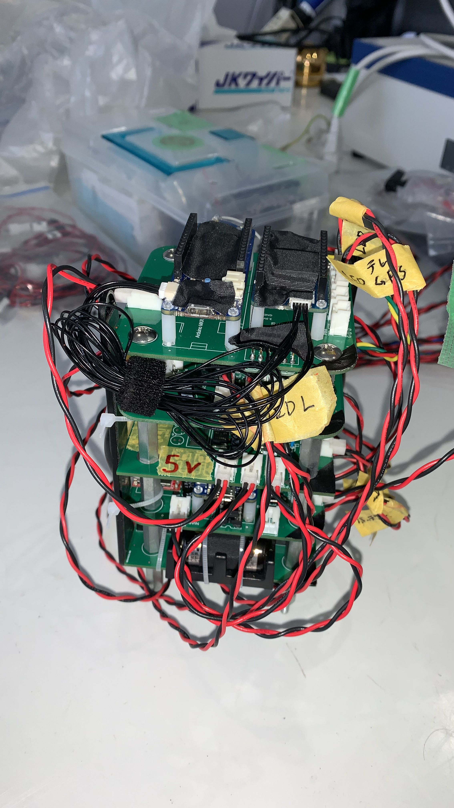

# H-57 搭載計器 解析資料

## フライトデータ

### 到達高度

速報値: __416.68m__ (X+9.22[sec])  
解析値: __402.14m__ (X+9.22[sec])

解析値は打ち上げ当日の海面気圧及び、該当高度の気温から以下の式を用いて到達高度を求めた。

$$ h=\frac{((\frac{P_{0}}{P})^{\frac{1}{5.257}}-1)\times(T+273.15)}{0.0065} $$

$$ P = 97279.27\text{[Pa] (測定値)} \\ P_{0} = 102340\text{[Pa] (海面気圧, ※1)} \\ T = -3.5\text{[degC] (ジオポテンシャル高度406mでの気温, ※2)} $$

- ※1 [毎日の全国データ一覧表（日別値:2023年03月04日）](https://www.data.jma.go.jp/obd/stats/data/mdrr/synopday/data7.html)
- ※2 [気温・湿度の観測データ(札幌　2023年3月4日9時)](https://www.data.jma.go.jp/obd/stats/etrn/upper/view/daily_uth.php?year=2023&month=3&day=4&hour=9&atm=&point=47412&view=)

### 頂点検知

分離ロジックは以下の二つのパターンがある。

- タイマーによる強制分離
- 頂点検知による通常分離

今回の分離は**タイマーによる強制分離 (X+9.98, 頂点の0.76秒後)** であった。

通常分離が行えなかった理由としては、以下で説明する平滑化の強度が弱く、頂点検知が遅れたことで、安全機構として組み込んだ強制分離が先に動作した。

#### 平滑化について

頂点検知は以下の手順で行われる。

気圧計測 > 高度算出 > 平滑化 > 10回連続降下検知

このうち、平滑化では任意の平滑化係数 a が必要であり、これが頂点検出の感度に影響する。今回は***よくわからんので適当***に a=0.25 とした。

結果としては X+11.09[sec] (頂点の1.87秒後) で連続降下検知数が10を上回っており、強制分離を考慮しない場合、この時間に通常分離が行われていた。

今回の打ち上げで得られた高度データにより、最適な平滑化係数を求めることが可能である。したがって、今後の打ち上げでは高い精度での頂点検知が期待できる。

### 終端速度

終端速度: **14~15[m/s]** (垂直成分のみ)

サンプル間の高度変化を時間変化で割ることで求めた。

詳細は[こちら | VerticalVelocity.csv](./Analysis/VerticalVelocity.csv)

### オープニングショック

## ハードウェア

### 損傷

基板や実装部品, コネクタ等に損傷は見られなかった。

|ラグの左側|ラグ側|ラグの対面|ラグの右側|
|---|---|---|---|
|||||

計器下のベークライト板に損傷を確認した。

ベークライト板の破壊によって計器への衝撃が緩和された可能性がある。

### EEPROM vs SDカード

SDカードからは全てのデータを回収できたが、EEPROMからはX+15.20[sec]以降のデータ読み出しができなかった。

※ EEPROMは現在解析中 (会議までには結論づける)

### 外部給電

外部給電はアンビリカルケーブルで行い、離床時にコネクタ部分で解放され、同時に内部電源に切り替わる設計である。

離床前は外部給電により 変圧後 12[V] が供給されていた。離床直後も内部電源に切り替わり 変圧後 12[V] が供給されていた。なお、電源切り替え時の瞬電は起こらなかった。

### フライトピン

フライトピン, 外部給電ともに線の破断はなく、コネクタ部分から解放されていた。

## 無線通信

アップリンクでの分離コンフィグ設定は成功した。

### 電波強度

地上局の受信強度RSSIは以下の通りである。

||最小[dBm]|最大[dBm]|
|---|---|---|
|離床前|-95|-91|
|着地前|-117|-94|

いずれの強度でも問題なくダウンリンクを受信することができた。

## 地上局

### GNSS

---

いかがでしたか？
