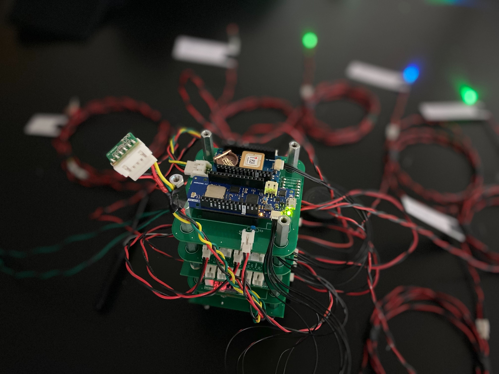

<!--
いい感じの画像を挿入したい。
参考にしたところ
https://github.com/VoronDesign/Voron-Trident
オープンソース3Dプリンタープロジェクト「VORON」
-->

# H-57 搭載計器

TSRP-H-57に搭載する計器類のプログラム及び設計書を保存するレポジトリです。

## フォルダ構成

[.](./)  
┣━ [ExperimentalComponents](./ExperimentalComponents/) ... 地上試験用のコンポーネント  
┗━ [FlightComponents](./FlightComponents/) ... 機体に搭載するコンポーネント  
　　┣━ [CommonInstrument](./FlightComponents/CommonInstrument/) ... 共通計器  
　　┗━ [Telemeter](./FlightComponents/Telemeter/) ... テレメータ

---

<!-- ©️ 1999 Tokai Student Rocket Project -->
[© 1999 Tokai Student Rocket Project](./FlightComponents/List.md)