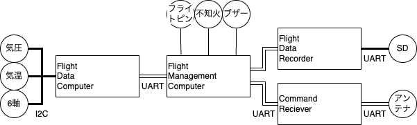

# 新型共通計器

## 概要

| 線の種類         | 通信方法                                                 |
| ---------------- | -------------------------------------------------------- |
| 細い実線         | GPIO                                                     |
| 太い実線（I2C）  | I2C シリアル通信                                         |
| 太い実線（UART） | UART シリアル通信                                        |
| 二重線           | CDTI（[後述](#cdti-common-data-transmission-interface)） |

### 気圧

LPS22HB を搭載予定

### 気温

未定（LPS22HB にも搭載されているが、補助的なもので精度が悪いため別で用意する必要がある。）

### 6 軸

MPU6050 を搭載予定

### フライトピン

ランチクリアを検知するために使用します。

### 不知火

不知火のリレーにつながります。[FMC](#fmc-flight-managemet-computer) からの出力は 5V ですが、リレーを介して 9V で不知火に入力する必要があります。

### ブザー

着陸後に機体を発見しやすいように音を鳴らします。

### CDTI (Common Data Transmission Interface)

コンポーネント間で正確かつ高速に通信を行うための形式です。UART シリアル通信に COBS エンコード のパケットを流します。パケットはデータ識別ラベル, ペイロード, [CRC8](https://ja.wikipedia.org/wiki/%E5%B7%A1%E5%9B%9E%E5%86%97%E9%95%B7%E6%A4%9C%E6%9F%BB) の 3 要素から構成されます。

[詳細](./FlightComponents/FlightDataComputer/README.md#フライトデータの形式)

### FDC (Flight Data Computer)

各種センサから得られたデータ（気圧, 気温, 加速度, 角加速度）から [FMC](#fmc-flight-managemet-computer) で必要なデータ（高度, 姿勢角）を計算します。

[詳細](./FlightComponents/FlightDataComputer/README.md)

### FMC (Flight Managemet Computer)

分離指令を出力することが主な役割です。上昇モードや降下モードといったフライトモードを実装しています。上昇モードから下降モードに遷移するために平滑化した高度データから頂点検出をします。

### FDR (Flight Data Recorder)

フライトデータを [マイクロ SD カード](#マイクロ-sd-カード) に保存します。

### マイクロ SD カード

フライトデータを保存します。固定に懸念がある場合は代わりに EEPROM を使用します。

### Command Reciver

地上からの指令を FMC に渡します。

### アンテナ

ダイポールアンテナを使用します。

---

©️ 1999 Tokai Student Rocket Project

_＿＿＿図面など存在しない。あったとしてもそれは偽物だ。_
