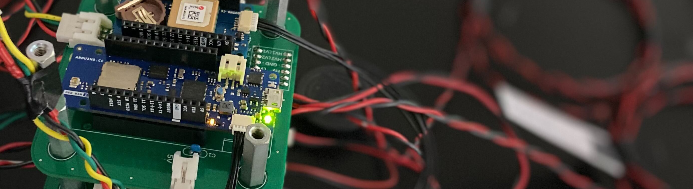

# H-57 搭載計器

TSRP-H-57に搭載する計器類のプログラム及び設計書を保存するレポジトリです。

## はじめに

H-57搭載計器は新型共通計器基板、テレメータ基板、バルブ制御基板および、電源基板から構成されます。

### レポジトリ構成

- 新型共通計器基板   
- テレメータ  
- バルブ制御基板 
- 電源基板 

### 資料

---

## フォルダ構成

[.](./)  
┣━ [ExperimentalComponents](./ExperimentalComponents/) ... 地上試験用のコンポーネント  
┗━ [FlightComponents](./FlightComponents/) ... 機体に搭載するコンポーネント  
　　┣━ [CommonInstrument](./FlightComponents/CommonInstrument/) ... 共通計器  
　　┗━ [Telemeter](./FlightComponents/Telemeter/) ... テレメータ

---

<!-- ©️ 1999 Tokai Student Rocket Project -->
[© 1999 Tokai Student Rocket Project](./FlightComponents/List_20230220.md)